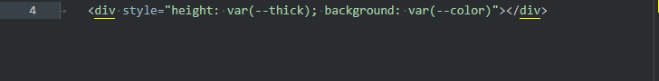
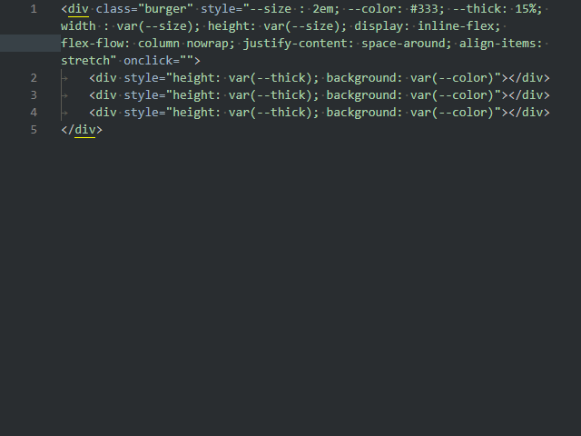

# Format tag attributes

Builds each attribute of the tag on a new line or in one line. Does the same with the style attribute rules.

- **Ctrl+Alt+Shift+A** - Toggle attributes      
- **Ctrl+Alt+Shift+S** - Toggle style properties

If you select several tags, you can change several tags at once.

